# Social-media
Angular, NestJS, PostgreSQL, TypeScript

## Contents
* [Main Information](#📜-Main-Information)
* [Stack](#Stack)
* [Installation and Usage](#Installation-and-Usage)
* [Examples](#Examples)

____

## 📜 Main Information

The Social-media application allows you to create an account, 
follow other users and send them messages.

### 1. Registration Page
Create your account by providing your first name, last name, and password.  
If the data is valid:
- A modal window will appear where you can add 
your hobbies and additional information about yourself.
- You can also upload your profile photo.

### 2. Login Page
Access your account using your registered credentials.

### 3. Home Page
The Home Page displays a list of all users. For each user, you can:
- View their personal information.
- Choose to follow them.

### 4. Chat Page
The Chat Page displays a list of chats. You can:
- Select a chat to message a specific user.
- Open a user's profile to view their details.

### 5. Messenger Page
The Messenger Page allows you to communicate with other users. 
Features include:
- Sending messages.
- Editing previously sent messages.
- Deleting messages.

### 6. Search Page
Use the Search Page to find users by their username or description.

### 7. Profile Page
Manage your account on the Profile Page. You can:
- Edit your personal information.
- Update your profile photo.
- Delete your account, if needed.

____

## Stack

✅ HTML, CSS, SCSS

✅ TypeScript

✅ Angular

✅ NestJS

✅ PostgreSQL

____

## Installation and Usage

The project consists of the two parts (server and client).

**Installation:**

* Clone the repository: git clone https://github.com/reyand8/Social-media.git

**Usage:**

* Server
    - Navigate to the server directory: cd server
    - Install dependencies: npm install
    - Configure .env file
    - Generate database: npx prisma generate
    - Add initial mutation: npx prisma migrate dev
    - Generate fake products: npm run seed
    - Run the server: npm run start:dev
    - Server will run on http://localhost:5001
* Client
    - Navigate to the project directory: cd Social-media
    - Install dependencies: npm install
        - Run the project: npm run start
        - Open a browser and navigate to: http://localhost:4200

* Using Docker
    - Navigate to the project directory: cd Social-media
    - Configure .env file
    - Run: docker-compose up

____

## Examples

____
____

### Login

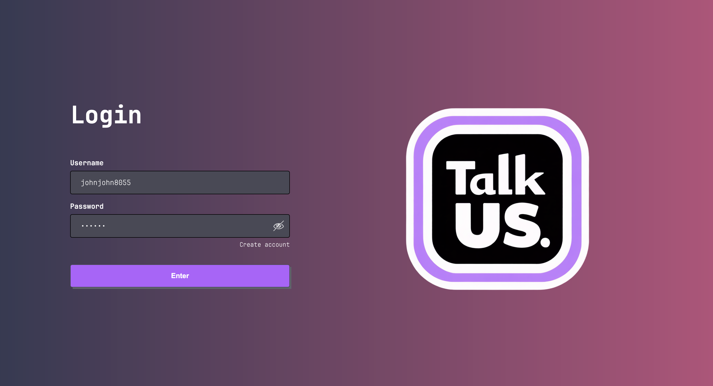

____
____

### Registration

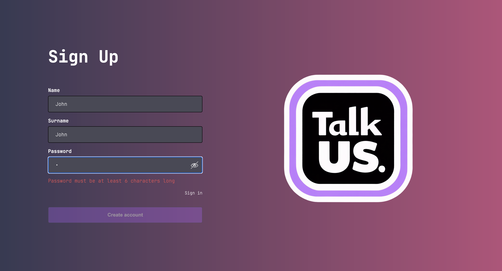

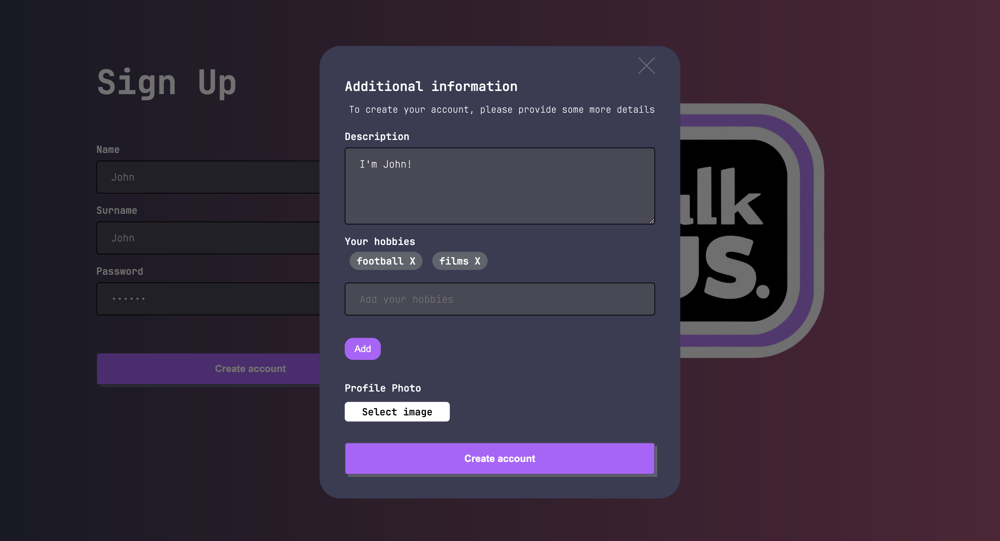
____
____

### Home

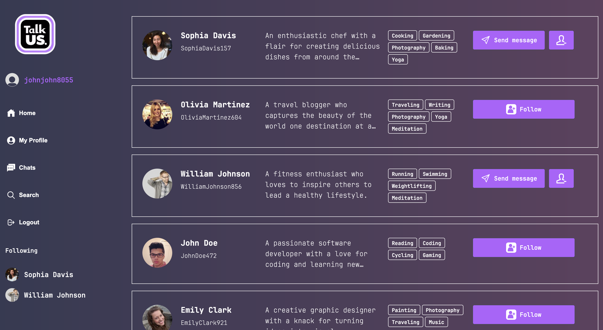

____
____

### Chats

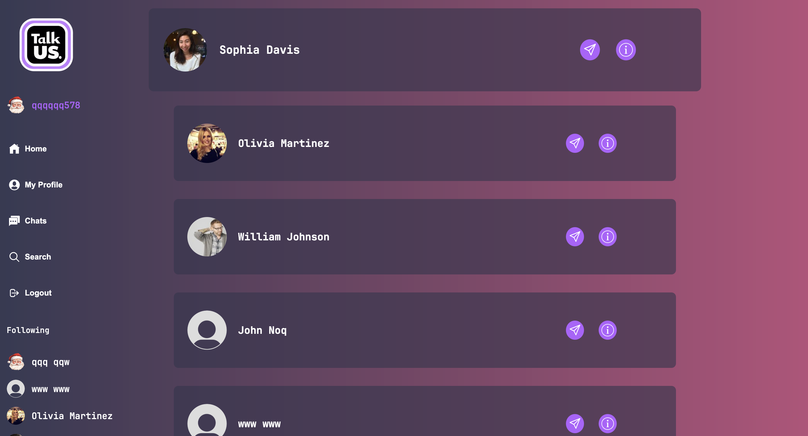

____
____

### Chat

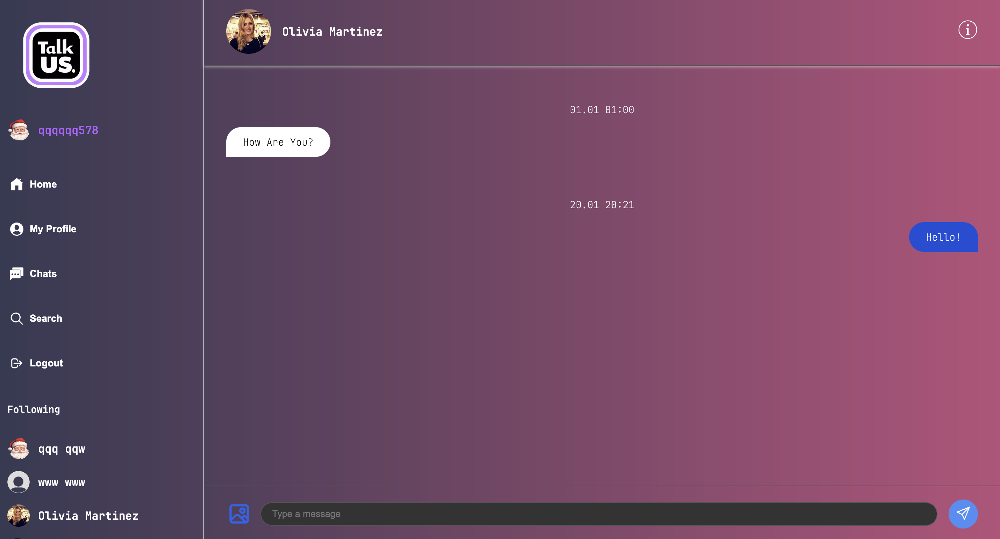

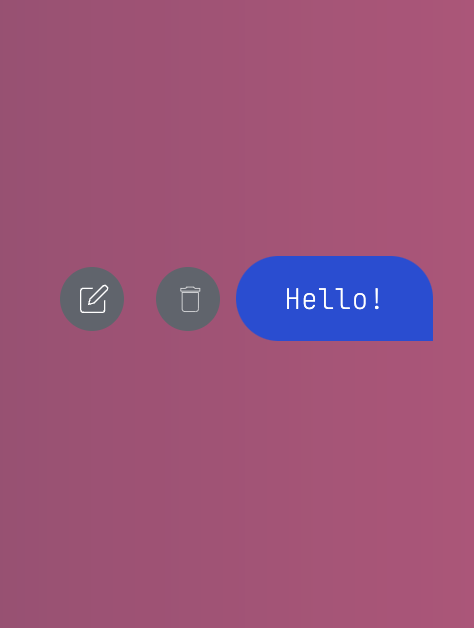
____
____

### User Info

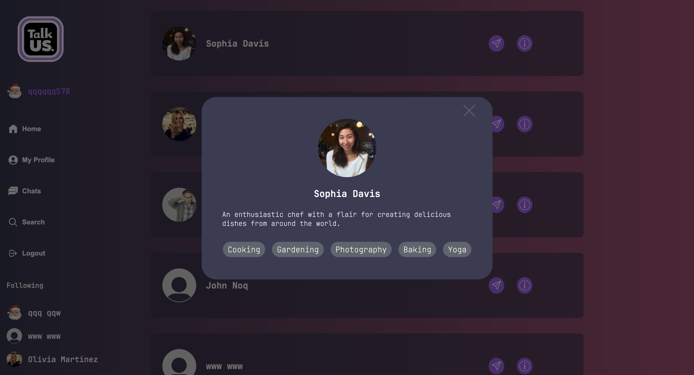

____
____

### Search

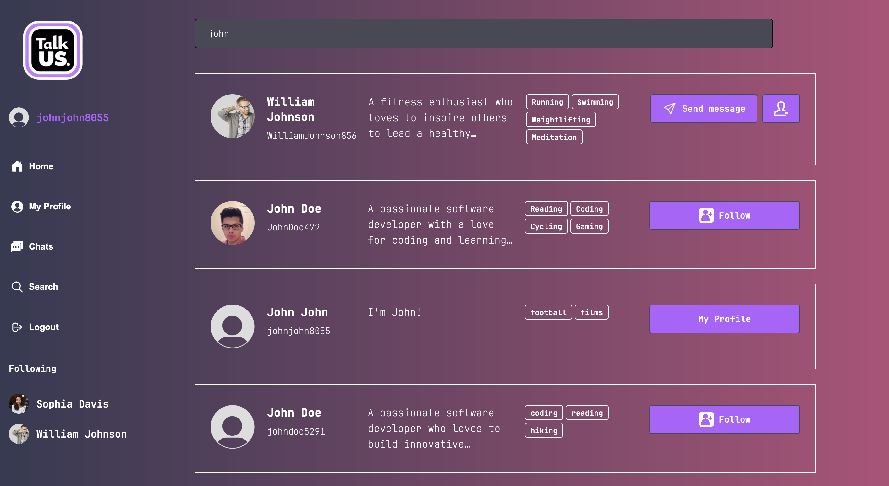

____
____

### Profile

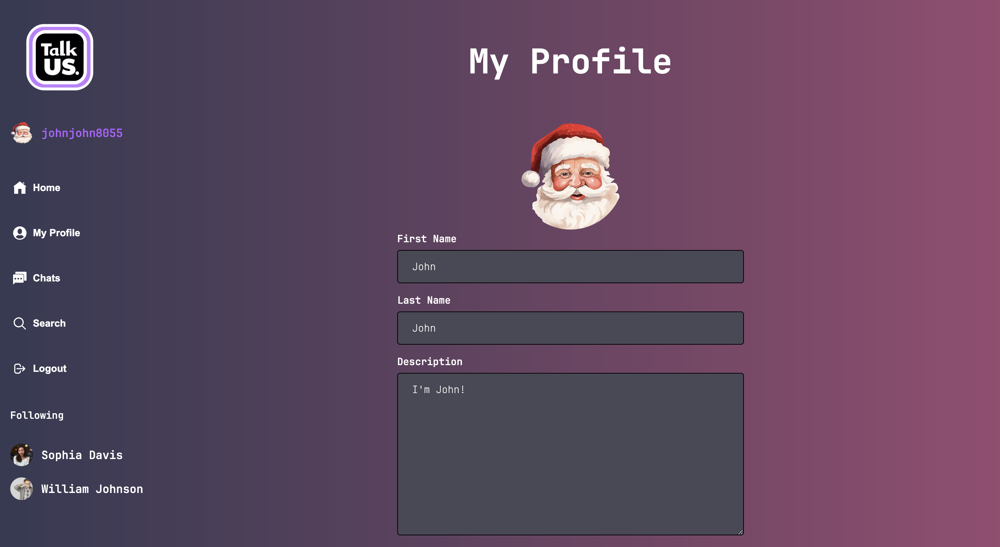

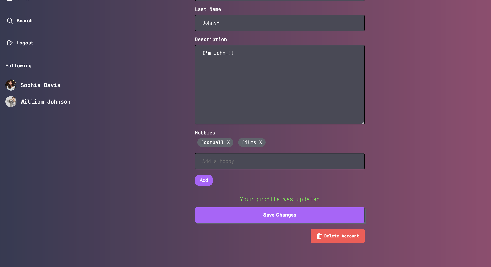
